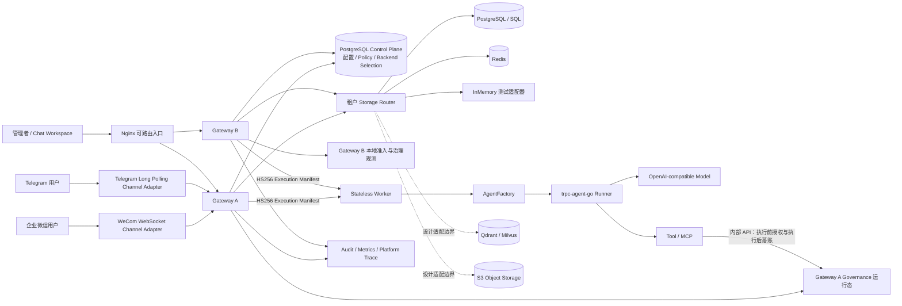
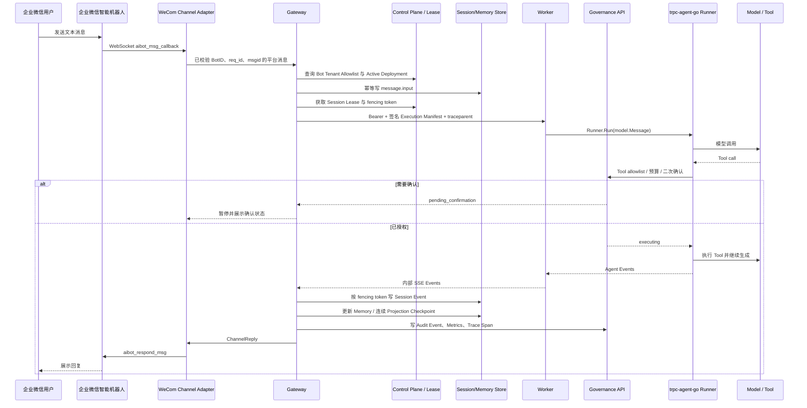

# 多租户节点化 Agent 平台架构

## 1. 目标与边界

本项目把 `trpc-agent-go` 的 Agent、Runner、模型、Tool、Plugin 和事件流能力包装成一个多租户部署平台。平台层不复制框架运行时，而是负责框架之外的业务约束：Tenant 身份、Agent App 注册、不可变 Deployment Version、发布路由、Session 所有权、后端选择、IM 绑定、治理、审计和故障恢复。公开兼容边界是 Management Console 使用的 HTTP API 与 SSE envelope；Gateway 与 Worker 之间的协议、数据库结构和 Go 内部接口可以按迁移规则演进。

比赛环境有两个运行配置。单节点开发配置使用 SQLite Control Plane Store 和可选择的 InMemory/SQLite 数据后端，必须先运行 `control-migrate`，Gateway 启动只检查 schema，不隐式改表。Stage 7 Compose 配置运行两个 Gateway、一个独立 Worker、PostgreSQL、Redis 和一个 Nginx 入口；PostgreSQL 是共享配置与 Session 数据的权威来源。InMemory 仅用于单元测试和确定性 fixture。

## 2. 系统拓扑

入口的 `X-Gateway: a|b` 只用于验收确定性选路，生产环境应由 Service 或负载均衡器分配。请求不依赖 sticky session：Gateway 在 PostgreSQL 中按 `(tenant_id, session_id)` 获取可续租的 Session Execution Lease，租约默认 30 秒、每 10 秒续租，每次重新授予产生单调递增 fencing token。Worker 不保存 Tenant、Deployment 或 Session 权威状态，因此实例重启不会改变请求应执行的版本。

## 3. 配置与执行链路

管理员先创建 Tenant 范围内的 Agent App 和 Deployment，再创建不可变 Deployment Version。Version 可以保存 `provider_profile`、`model`、`prompt` 与生成参数，但不能保存 API Key。服务端 `default-openai` Model Provider Profile 从 `OPENAI_BASE_URL`、`OPENAI_API_KEY`、`OPENAI_MODEL` 读取凭据；`gpt-5.6-*` 自动使用 OpenAI Responses 流式 API，其他兼容模型保留 Chat Completions 路径。缺少配置时开发模式使用确定性 Agent，production 模式拒绝启动。发布、激活、灰度和回滚只改变 Deployment 指针，不修改历史 Version。

公开 Chat 请求进入 Gateway 后，身份组件从受信任会话生成 Tenant Context，忽略客户端伪造的 tenant_id。Gateway 校验角色和治理策略，把 `message.input` 与 `run.started` 先写入 Session Event，再解析唯一 Active Deployment。跨 Gateway 的同一 Session 由 Lease 串行化；不同 Session 可以并行。Gateway 把解析后的 Tenant、App、Deployment、Version、Policy Revision、request_id、Platform trace_id、W3C traceparent 和 fencing token 写入 Execution Manifest，以专用可轮换 HS256 key 签名。Worker 只接受内部 Bearer Token，并拒绝缺失、过期、篡改、未知 key 或 traceparent 不一致的 Manifest。

Worker 根据 Manifest 中的不可变 Version 调用 AgentFactory，构造 `trpc-agent-go` Runner。Tool 回调进入 Plugin 时，Worker 通过内部 Governance API 再做一次 allowlist、预算、Guardrail 和危险操作确认检查；治理不可用时 fail closed，副作用不会开始。Runner Event 被转换为稳定的 `message.delta`、`message.completed`、`run.failed`、`run.cancelled`、`run.completed`，Gateway 写入 Session Event 并通过 SSE 或 Channel Adapter 返回。事件写入携带 fencing token，已失去租约的旧执行不能覆盖新所有者结果。

## 4. 企业微信完整时序

企业微信实现使用 API 模式智能机器人 WebSocket，不使用 CorpID、AgentID、应用 Secret 或传统 HTTP 回调。Telegram 实现使用 long polling 接收 Update、使用 `sendMessage` 回复。两种通道都先经过服务端 Bot Tenant Allowlist；群聊 Session ID 由 provider account 与 chat ID 派生，单聊由 provider 与用户/会话标识派生，Tenant ID 始终参与存储 key，跨群同名用户不会合并数据。`msgid`/Update ID 形成幂等 request_id，重复或乱序消息不触发第二次执行。

## 5. 数据隔离与一致性

Control Plane Store 保存 Tenant、Agent App、Deployment、Version、Channel Binding、Backend Selection、Governance Policy 与配置幂等记录。每次读取按共享 revision 刷新，Gateway 不以进程本地旧配置维持正确性；从旧本地治理文件升级且共享策略为空时，会一次性导入策略。Session Event 是运行数据事实源，Session State 与 Summary 是只允许连续推进的投影，`projection_sequence` 表示已经消费的最高事件序号；发现序号空洞时拒绝产生看似最新的状态。Memory 和 Knowledge 在执行前按 Tenant/App/Session 查询并注入 Agent 输入。Knowledge 权威文本先提交，向量索引属于最终一致派生物，即使索引处于 retry 状态，权威内容仍可读取。

Artifact 元数据记录 Tenant、Session、request_id、trace_id、状态与 content reference。参考实现把 Agent 完成回复发布为指向 `message.completed` 的 `session-event://` 引用；如果内容或元数据发布失败，写入 `artifact.publication.failed`，不报告虚假的 `run.completed`。生产对象内容应由 S3 适配器保存，SQL 只保存引用、校验和与发布状态。

所有公开查询从 Tenant Context 注入 tenant_id，不把“另一个租户确实存在”暴露给调用者。模型密钥、IM 凭据、数据库口令、Manifest key 和 Governance token 都来自环境或生产密钥管理器；Deployment、浏览器状态、Audit、Trace、错误响应和验收证据不保存这些值。日志 Redactor 在写出前处理已配置 secret。

## 6. 治理、观测与运维

治理顺序是身份与外部主体授权、速率与预算预留、输入 Guardrail、Tool/MCP allowlist、危险 Tool 确认、输出 Guardrail、用量结算。危险 Tool 状态为 `pending -> approved -> executing -> completed|failed|outcome_unknown`，或由 `pending -> rejected` 直接以 `run.failed` 终结并释放预算；重复决策幂等。Worker 在 `executing` 期间断连或进程重启会转为 `outcome_unknown`，此状态不会进入自动 replay；操作员必须调查外部副作用后人工处理。

每次请求同时拥有业务 `request_id`、平台 `trace_id` 和 W3C `traceparent`。Trace span 覆盖 channel callback、storage read/write、Worker、AgentFactory、Runner、Tool 和 channel reply；Audit Event 至少包含 tenant、channel、user、session、agent、tool、decision、latency、error_type、cost 与 trace。指标按 Tenant 聚合请求、失败、限流、token、成本、模型/Tool/存储延迟和 IM 投递结果。

SIGTERM 的阶段顺序是：先把 readiness 变为 closing 并停止 IM 获取，再停止 HTTP admission；给在途请求独立等待期限，超时后广播 context cancellation，再给事件终结与资源关闭独立期限。生命周期服务使用单一完成信号，不为每次 Wait 创建 goroutine；Runner adapter 不创建无限 drain goroutine。模型超时会把 Worker 标记为不可用并退休，避免不合作执行继续接单。

## 7. 风险清单

| 风险 | 影响 | 缓解措施 |
| --- | --- | --- |
| 同一 Session 跨节点并发写 | 历史乱序或覆盖 | PostgreSQL Lease、续租、单调 fencing、原子写校验 |
| Worker 在 Tool 副作用后崩溃 | 自动重试造成重复操作 | executing 持久化、重启转 outcome_unknown、禁止自动 replay |
| IM 重复或乱序投递 | 重复计费与重复回复 | provider sequence、message ID 幂等 key、终态检查 |
| PostgreSQL 暂时不可用 | 配置或 Session 无法确认 | 有界超时、`control_plane_unavailable`/`storage_unavailable`、不读本地旧缓存 |
| 模型不响应或忽略取消 | 关闭卡死、容量耗尽 | 服务端 runtime timeout、Worker 退役、分阶段关闭 |
| Manifest key 泄露或轮换错误 | 伪造执行或全量失败 | 专用 keyring、kid、短有效期、双 key 验证窗口 |
| 跨租户资源猜测 | 数据存在性泄露 | 受信 Tenant Context、组合 key、空集合/统一 not found |
| Guardrail 流式输出后才发现敏感内容 | 已泄露部分 token | 需要严格输出策略时启用完整缓冲再发布 |
| Memory 已提交但向量索引失败 | 检索暂时不完整 | 权威记录先提交、checkpoint/retry 状态、可重建索引 |
| Artifact 内容成功而元数据失败 | 孤儿对象或假成功 | 发布状态机、失败事件、后台按 request/trace 对账 |
| 审计存储失败 | 无法证明高风险操作 | 高风险路径 fail closed，普通失败返回稳定错误 |
| 配置迁移与旧进程并存 | schema 不兼容 | control-migrate 前置、Gateway 只做版本检查、expand-contract |

## 8. 已实现与设计边界

已实现的是 SQLite/PostgreSQL Control Plane、InMemory/Redis/SQLite/PostgreSQL Session/Memory 参考存储、SQL Artifact/Knowledge 元数据、支持 Chat Completions 与 Responses 的 OpenAI-compatible AgentFactory、签名远程 Worker、内部 Tool 治理、Telegram/企业微信适配、SSE、审计/指标/Trace、灰度回滚与有界关闭。S3 对象内容、Qdrant/Milvus 向量索引和 Kubernetes 清单属于明确的适配器设计，不在比赛代码中伪装成已上线集成。

多 Gateway 已共享 Governance Policy 与 Backend Selection，但 Compose 的内部 Governance 请求固定路由到 Gateway A，确认、执行中 Tool、预算计数、Audit 和 Trace 仍是该实例的持久运行态。生产多副本应把这些状态迁入具备事务语义的共享存储，并把内部 Governance API 放在高可用 Service 后；这一项是从比赛参考部署扩展到真实生产规模时的前置条件。
