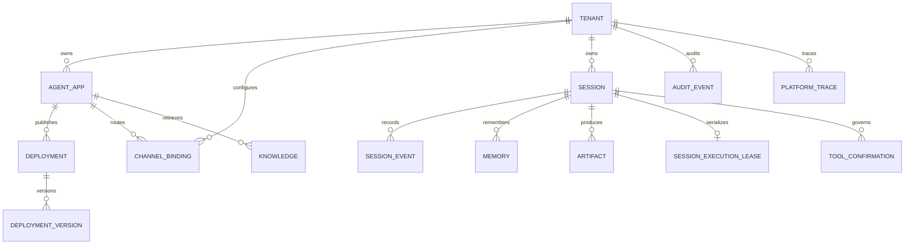

# 数据模型设计

## 所有权与主键

所有业务对象都直接或间接归属于 Tenant。除平台级 Provider Account 外，存储查询不得只用自然 ID；推荐主键或唯一键必须包含 `tenant_id`。客户端提交的 `tenant_id` 不参与授权，Gateway 从身份会话得到 Tenant Context 后写入查询条件。

| 实体 | 主键/唯一键 | 关键字段 | 关系与约束 |
| --- | --- | --- | --- |
| Tenant | `tenant_id` | name, audit_policy | 隔离根 |
| Agent App | `(tenant_id, app_id)` | name | Tenant 1:N App |
| Deployment | `(tenant_id, deployment_id)` | app_id, status, current/target/previous_version_id, gray_percentage | 同一 App 只有一个 Active Deployment |
| Deployment Version | `(tenant_id, deployment_id, number)`，全局 version_id | provider_profile, model, prompt, generation_config | 发布后不可变，不含凭据 |
| Backend Selection | `(tenant_id, data_kind)` | adapter_id, server_owned_config_ref | 客户端只能选择服务端目录中的 adapter |
| Channel Binding | `(tenant_id, binding_id)` | app_id, provider, account, external_subject, session_id, enabled | 外部主体映射到 Tenant/App |
| Session | `(tenant_id, session_id)` | app_id, user_id | 由事件流物化 |
| Session Event | `(tenant_id, session_id, sequence)` | event_id, idempotency_key, type, payload, fencing_token, occurred_at | sequence 连续；幂等 key 唯一；事实源 |
| Projection Checkpoint | `(tenant_id, session_id, projection)` | last_sequence, updated_at | 只能从 N 推进到 N+1 |
| Session State | `(tenant_id, session_id)` | projection_sequence, summary, updated_at | Session Event 的可重建投影 |
| Memory | `(tenant_id, session_id, memory_key)` | value, updated_at | 权威值先提交 |
| Knowledge | `(tenant_id, knowledge_id)` | app_id, source, content_ref/content, index_status | 索引为派生状态 |
| Artifact | `(tenant_id, artifact_id)` | session_id, request_id, trace_id, content_reference, status | 内容与元数据分离 |
| Audit Event | `(tenant_id, audit_id)` | channel, user_id, session_id, agent_name, tool_name, decision, latency, error_type, cost, trace_id | 追加记录 |
| Platform Trace | `(tenant_id, trace_id)` | request_id, session_id, app_id, spans | 跨组件关联 |
| Session Execution Lease | `(tenant_id, session_id)` | owner_id, fencing_token, expires_at | 每次授予 token 单调增加 |
| Tool Confirmation | `(tenant_id, confirmation_id)` | request_id, tool_name, argument_summary, policy_revision, status | 副作用治理状态机 |

## 关系



## Session、投影与 fencing

Session Event 的 `(tenant_id, session_id, idempotency_key)` 唯一。相同 key 与相同 type/payload 重试返回原结果；相同 key 携带不同内容返回冲突。append 在事务内读取当前最大 sequence 并写入下一条。持有 PostgreSQL Session Execution Lease 的 Gateway 把 fencing token 附在执行相关写入；数据库在同一事务内确认 token 等于该 Session 当前最高 token 后才插入事件。租约过期允许当前 token 完成有界收尾，但一旦新 owner 获得更高 token，旧 token 立即返回 `stale_fencing_token`，不能更改事件、Memory、Artifact、State、Summary 或执行终态。每次授予另写一条 token 唯一的 `session.lease.acquired`，新 owner 用当前 token 为遗留的未终结请求写入 `run.cancelled`。

`SessionState.projection_sequence` 是参考实现的 Projection Checkpoint。物化器严格按 sequence 读取，遇到缺口立即失败，不跳到后续事件。Summary 只在已连续处理的事件上更新；删除派生 State 或 Summary 后，可以从 Session Event 重新构建。

## 执行与 Tool 状态

一次执行由 `(tenant_id, request_id)` 标识，并固定 Deployment Version、Policy Revision、trace_id、traceparent 与 fencing token。公开事件终态只能有一个：`run.completed`、`run.failed` 或 `run.cancelled`。恢复逻辑先检查事实源中的 input、started 和终态，再决定返回已有结果还是继续未开始的部分。

危险 Tool 状态转换为：

```text
pending_confirmation -> approved -> executing -> completed
                     \-> rejected              \-> failed
                                                \-> outcome_unknown
```

只有 approved 可以原子消费为 executing；重复审批保持幂等，rejected/expired 不可执行。服务重启时遗留 executing 变为 outcome_unknown，因为平台无法证明外部副作用是否发生。outcome_unknown 不自动回到 approved 或 pending。

## Knowledge 与 Artifact 状态

Knowledge 的 SQL 元数据和权威文本先成功提交，再创建向量索引任务。`index_status` 至少区分 authoritative/pending、indexed、retry_pending 和 failed；checkpoint 记录最后已索引版本，重试按 knowledge_id 幂等覆盖派生索引。索引失败不删除权威记录。

Artifact 推荐使用 `pending_content -> content_written -> published`，异常进入 `publication_failed` 并由 request_id/trace_id 对账。当前参考实现保存 SQL/InMemory 元数据，并用 `session-event://...` 引用已持久化的完成消息；S3 适配器应增加 object version、checksum 和临时对象回收字段。
